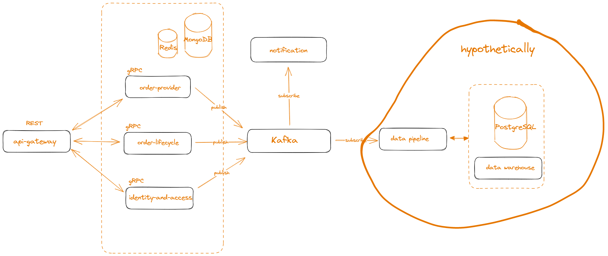

## todo
 - 
 - 
 -
 -
 -

## whats it look like?

<p align="center">
  
</p>

```
API

Headers:
  Authentication: Bearer <access_token>

+ Get one:  
GET  /orders/:id?fields=item,quantity

+ Get many: 
GET  /orders?order_status=1&offset=20&limit=10&fields=item,quantity

+ Create:   
POST /orders

+ Update:   
PUT  /orders/:id?opcode=<number>
    opcode: 
      0 - Confirm
      1 - Complete
      2 - Cancel
```